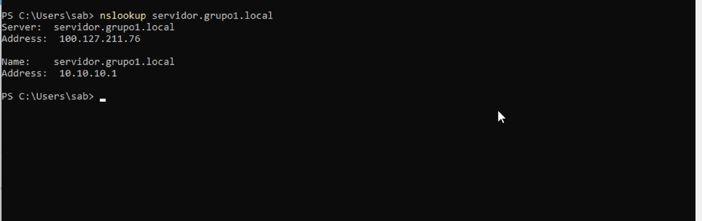
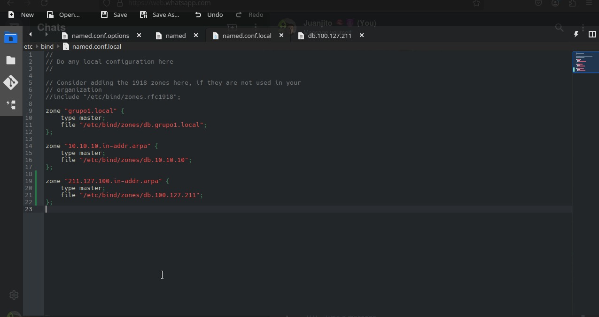
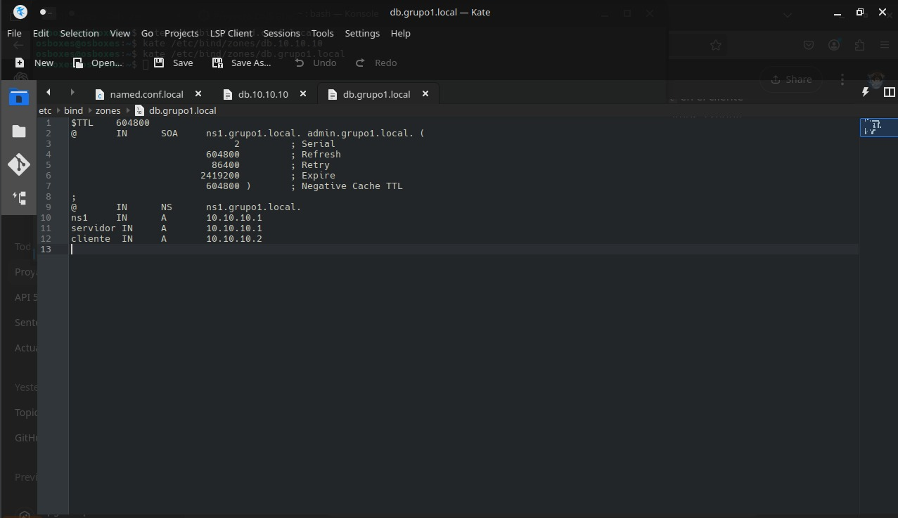
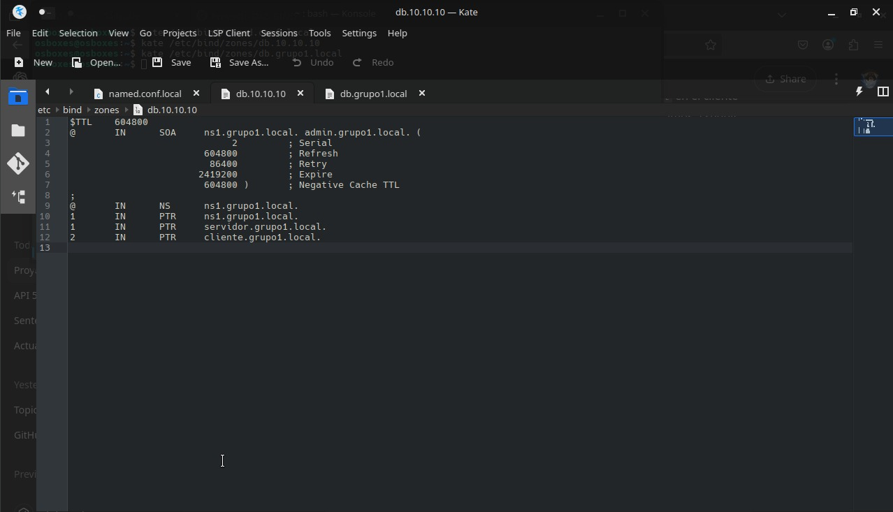
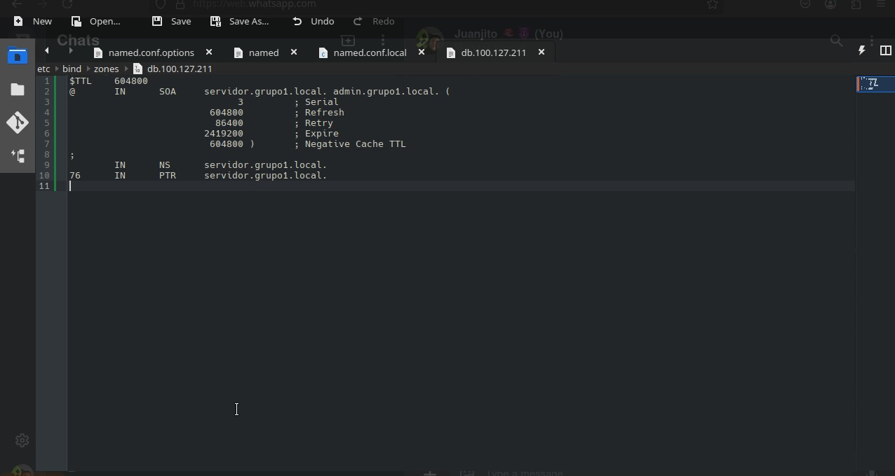
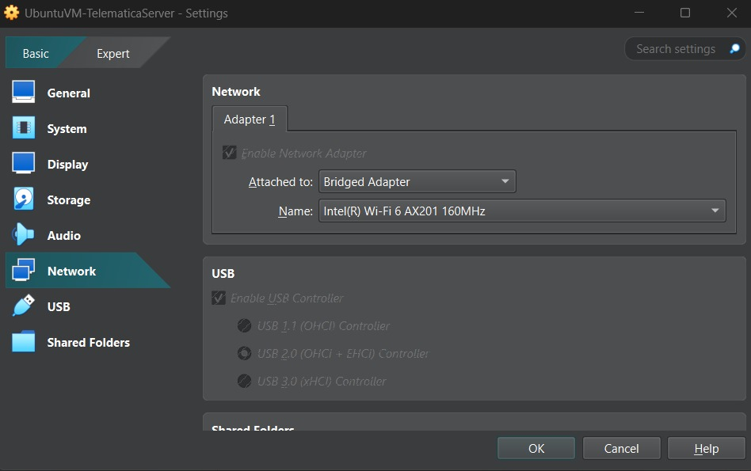
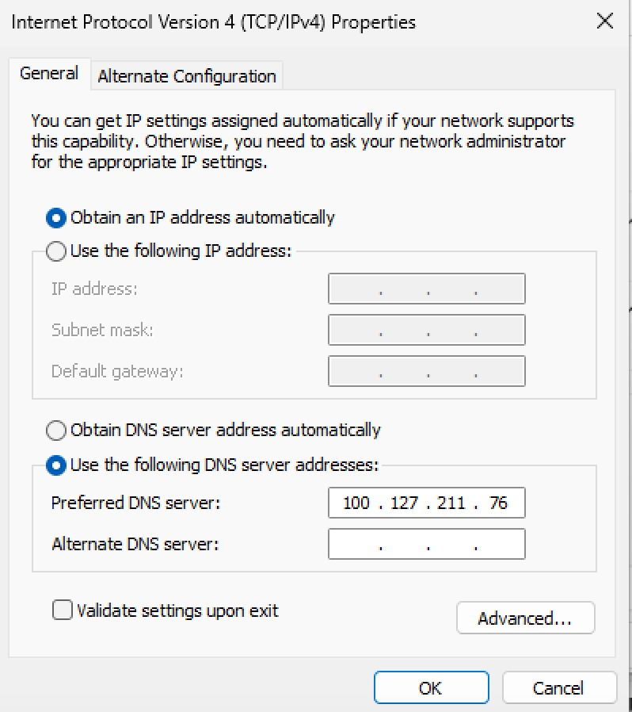
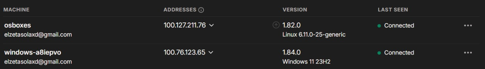
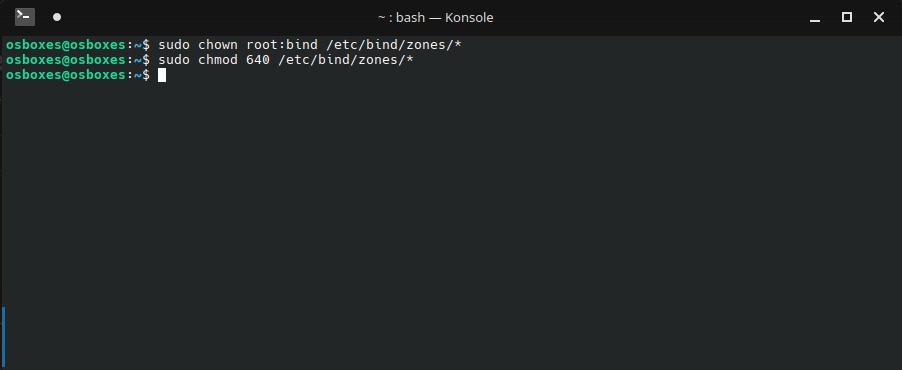
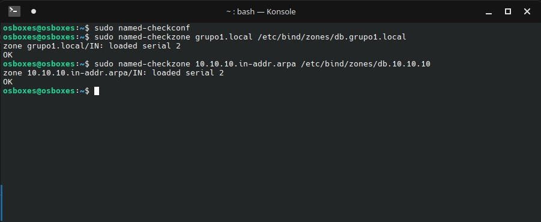

# Proyecto Final - Servidor DNS con BIND en Entornos Virtuales

## Integrantes: Juan Jose Vasquez Gomez, Maria Fernanda Alvarez

## 🎥 **Video:** 

## 📌 Introducción

Este proyecto consiste en el diseño, implementación y prueba de un servidor DNS utilizando el servicio BIND en una máquina virtual con Ubuntu Studio, ejecutándose en VirtualBox (host Windows 11). La validación del funcionamiento se realizó desde una máquina cliente con Windows, ejecutándose en otro host (Mac) a través de UTM. Ambas máquinas se conectaron por medio de la red virtual privada Tailscale, permitiendo pruebas realistas de resolución de nombres en entornos distribuidos.

El objetivo principal fue configurar el servidor DNS con zonas directa e inversa funcionales, asegurando la correcta resolución de nombres mediante herramientas como `dig` y `nslookup`.

---

## ⚙️ Desarrollo

### Entorno y herramientas utilizadas

- **Servidor DNS:** Ubuntu Studio en VirtualBox (host: Windows 11)
- **Cliente DNS:** Windows 11 en UTM (host: macOS)
- **Red privada virtual:** Tailscale
- **Servicio DNS:** BIND9
- **Zona simulada:** `grupo1.local`
- **Zona inversa:** basada en IP Tailscale `100.127.211.76` → zona `76.211.127.100.in-addr.arpa`

### Pasos realizados

1. **Instalación del servidor DNS (BIND):**
   - `sudo apt install bind9 bind9utils bind9-doc`

2. **Configuración de archivos:**
   - `named.conf.local`: Definición de zonas directa e inversa.

   
     
   - Archivo de zona directa (`db.grupo1.local`) creado en `/etc/bind/zones/`.
  
   

   - Zona inversa (`db.10.10.10`)
   
   

   - Zona inversa (`db.100.127.211`) verificada para devolver el nombre `servidor.grupo1.local`.
     
   

4. **Configuración de red del cliente y del servidor:**
   - Uso de IP Tailscale del servidor como DNS manual en configuración de red del cliente Windows.

   - Configuración Red Ubuntu (Servidor)
     
   

   - Configuración Red Windows (Cliente)
     
   

   - Configuración Red Tailscale
     
   

6. **Permisos y Chequeos de funcionamiento**

   - Asignación de permisos

   

   - Chequeos de funcionamiento

   

7. **Validación:**
   - Pruebas de resolución con `nslookup` y `dig`.
   
   
   

8. **(Opcional) Modo chroot (modo jaula):**
   - Se intentó la configuración en `/var/named/chroot`, pero se descartó por conflictos de permisos y errores al iniciar el servicio.

---

## ✅ Aspectos Logrados y ❌ No logrados

### ✅ Logrados

- Instalación y configuración completa de BIND.
- Archivo de zona directa funcional (`grupo1.local`).
- Archivo de zona inversa funcional para IP de Tailscale.
- Validación completa desde una máquina remota mediante `nslookup`.
- Conectividad funcional usando Tailscale entre dos redes distintas.
- Documentación en video y capturas.
- Reverso funcional que responde con `servidor.grupo1.local`.

### ❌ No logrados

- Ejecución exitosa de BIND en modo chroot. Se presentaron errores relacionados con rutas y permisos que impidieron su correcta puesta en marcha, por lo cual se volvió a la configuración tradicional fuera del modo enjaulado.

---

## 🧠 Conclusiones

El proyecto permitió comprender de forma práctica la arquitectura y configuración de un servicio DNS interno, así como la importancia de los archivos de zona directa e inversa. Se destacó el valor del aislamiento de servicios (modo chroot), aunque se requiere más tiempo para su dominio completo.

Además, el uso de herramientas como Tailscale facilitó una red privada funcional entre entornos virtuales diferentes, mostrando una solución viable para laboratorios distribuidos y seguros.

Este ejercicio refuerza habilidades esenciales en redes, seguridad y administración de servicios Linux, y demuestra cómo integrar múltiples tecnologías para lograr una solución funcional en entornos reales o simulados.

---
